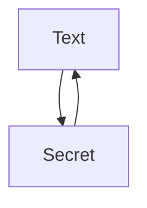

# gpgservice

This code is based on https://golang.cafe/blog/golang-rest-api-example.html 

# Purpose

Ths is a central encrypt and decrypt service. Encrypted secrets can be stored "everywhere".
For the purpose of decryption this service has to be called again.


Conversation is done via https.

## attention

Altough the ecnryption/decryption based on https://www.openpgp.org/ is quite secure -> this service is not.
When you can physically access the encrypted secret -> you can just ask this service to decrypt it (and it will do).
There is nothing like a "closed usergroup" or a "token to be allowed to decrypt". This is not the purpose of this service.

# Build and deploy GO module

Here you will find the go sources and the routinges to build and deploy.

````bash
./build.sh
````

This command will build a local go (for testing purposes).

````bash
./deploy.sh
````

This command will deploy it to the corresponding docker repository.

````bash
./run.sh
````

This command will run the builded docker-image localy.

````bash
./kubectl apply -f gpgsecret.yaml
````

This commando will deploy all the necessary kubernetes elements.

````bash
./gpgservcie-test.sh
````

This commando will execute some test-statements.

# REST Calls

This software will accept the following REST-Calls.
Please note: all text is base64 encoded https://manpages.ubuntu.com/manpages/bionic/man1/base64.1.html

## status

Thie call can be used as /healtz and as /metrics

Results will state how many encryption and decryption calls have been done.

````bash
curl https://${podip}/status
````
Result will be

````json
{"noencrypt":"1","nodecrypt":"5","version":"1.17.12","doku":"https://gitlab.com/Alfred-Sabitzer/microk8s-ubuntu/-/tree/master/gpgsecret?ref_type=heads"}
````

## encrypt

This call will encrypt a given text.

````bash
mytext=$(echo "verysecrettext" | base64 base64 -w 0)
myresult=$(curl -X POST -H 'content-type: application/json' --data '{"text": '"${mytext}"'}' http://"${podip}"/encrypt)
````
Result will be similar to

````json
{"text": "LS0tLS1CRUdJTiBQR1AgTUVTU0FHRS0tLS0tCgogIGhRSU1Bd3VlbE1yeURpbFVBUS85Rm5PSTYyWUY0OW5qbUdlS0sxS29HTFNKSCsrZlJTUXlQQ3NPNkhCMlpCS1gKICBXbmtZSEd4dDhTV2VYc3IxVmdyOFNBVzZub0NlNmdkK1VHcmF1STRJWUh5dHI4QUdwYlF3aUtkUk13dVVHZlkrCiAgek1MT1JBYVBabkFmRUQzbXR6TWdhaGtTRVRDVXNVelU4UG9WcFhBY2RZSEpraEs3TXN2Tmh4UnhBNmJWc1l5SgogIEpvc1FqSG9IQzEzV1NmODlMWDFRTmxKS01GSWpqdm5qNXo5M1FFaUpPRVJDSTZHT3ZGK3F2M2pCZU5wZGpHaFEKICBMRHhHTlR5dFFOaUc2anp6SXNKV1VCVGdFT3VFYVBHaFNsWjJBWERQV00wMk1rVXdkbUIwV1A3Y3Zrb0RlbjV0CiAgK3FVUGZ1Qkhwa0NmdE5FZVFjZ3BHdlI4YnNIZWtLRVhIZHc5YUQ3NWJnSkxxeWQ2dE1JWitXd0xZaGs4SlZodAogIENWRytxL2NvZWpYSnV4UGhCMCtGeldRY0dNdXRkVGJQSDNiNS8vYUVmekJqRUY1dlFxL09aMm15SUU3Q3grSzMKICB0eFFyMUNXYWRXMEhCdDFvQ1BYbVNUdXV4SExXZTdEZm9rdUdLU3BlczFUVXEzZHYwWUNUeUxYQzhkNWR6OGIxCiAgbWNCT3NQMVpNVlo5UXJQZWN5TWhTSHVKY2U2b0xTYTN2cExpRytzSlJOZGxsMFIxTlYyaUdnOEgvS0RRZERqKwogIDBFQnZiL2ZTLzZGOWludkVXTjhZc24wSjJrTkI0L3I1bWVrYkdpbDluZC9xT0grMHEzUGFRb3ppUVI0cDl0eHAKICBPeDgvNlhNNnM5cnJRQWRQeGVwaWJFMFYzU084UWF6VlZQYlRxSTJ5R3J0R3JUdURtVy92MVRoUWR0emxuVkhTCiAgVmdHWUoxMUdiUlRaQ1doRE55R2NneGtwRTIvYTAvbThmdXJscGliQytkM0I4MG9FWDBPdSs1TldtM0N5WHpxVQogIEU5U3pxbFNPZ3owb3RuaUEwSzgrSnMyRkNRUVJwc3FGb1lZblpoQjcveVJWOFZOSy9aK0sKICA9US9ScQogIC0tLS0tRU5EIFBHUCBNRVNTQUdFLS0tLS0K"}
````

## decrypt

This call will decrypt a given text.

````bash
curl -X POST -H 'content-type: application/json' --data '{"text": '"${myresult}"'}' http://"${podip}"/decrypt
````
Result will be similar to

````json
{"text": "dmVyeXNlY3JldHRleHQK"}
````

Decryption can be done via base64

````bash
echo "dmVyeXNlY3JldHRleHQK" | base64 -d -w 0
verysecrettext
````
